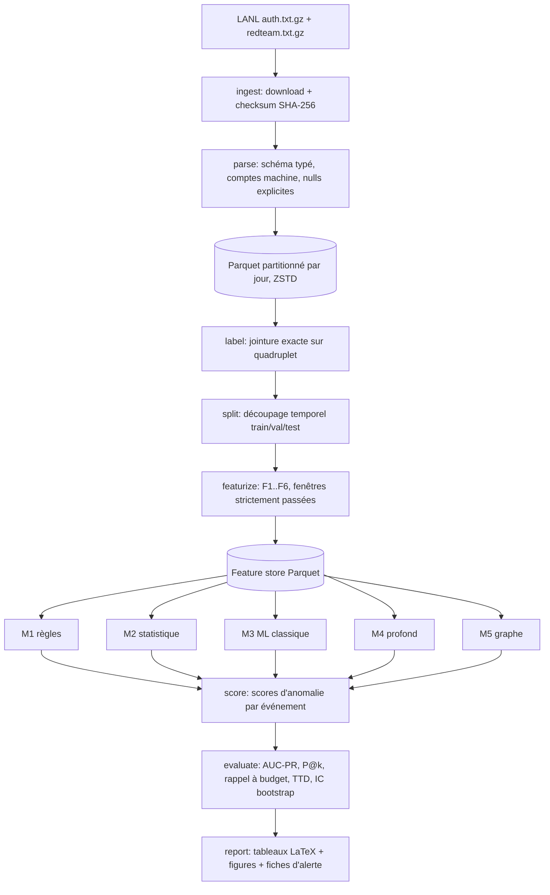

# AuthBench — Spécification complète

**Détection d'anomalies sur journaux d'authentification : évaluation comparative sous
contrainte de budget d'alertes**

Version 1.0 — 25 juillet 2026

---

> **Errata — ce document précède les mesures.** Il est conservé tel quel comme
> document de conception ; deux de ses chiffres n'ont pas survécu au contact des
> données, et c'est le protocole qui a fonctionné, pas le document qui a
> échoué — la section 4.2 demandait justement que tout écart soit publié.
>
> | Spécifié | Mesuré | Où |
> |---|---|---|
> | `redteam.txt.gz` : 749 lignes, 12 doublons → **737** uniques | 749 lignes, **34** doublons → **715** uniques | `parse.clean.clean_redteam`, `conf/dataset/lanl.yaml` |
> | Découpage 0–29 / 30–39 / 40–57 | **impossible** : l'équipe rouge s'arrête au jour 29, ce découpage laisse validation et test sans un seul positif. Le run publié utilise jour 5 / 8 / 12 | `conf/split/temporal.yaml`, `docs/methodology.md` |
>
> Le protocole réellement implémenté est décrit dans
> [`docs/methodology.md`](docs/methodology.md), ses limites dans
> [`docs/limitations.md`](docs/limitations.md), et les résultats dans
> [`reports/lanl/RUN.md`](reports/lanl/RUN.md).

---

## Sommaire

1. Positionnement et question de recherche
2. Jeux de données
3. Architecture technique
4. Modèle de données et ingénierie des caractéristiques
5. Catalogue de modèles
6. Protocole d'évaluation
7. Épics et user stories
8. Découpage en sprints
9. Exigences non fonctionnelles
10. Livrables et présentation
11. Pièges connus et menaces à la validité
12. Sources

---

## 1. Positionnement et question de recherche

### 1.1 Le problème réel

Un SOC ne peut pas traiter plus de quelques dizaines d'alertes par jour et par analyste.
Un modèle qui détecte 95 % des attaques en produisant 50 000 alertes quotidiennes est
inutilisable. La littérature académique sur la détection d'anomalies dans les journaux
d'authentification publie pourtant massivement des scores ROC-AUC de 0,98 sur des données
dont le taux de positifs est de l'ordre de 10⁻⁷ — une métrique qui, à ce niveau de
déséquilibre, ne dit à peu près rien de l'utilisabilité opérationnelle.

### 1.2 Ce qui différencie AuthBench

Le projet n'invente pas un modèle. Il construit un **banc d'essai honnête** et mesure ce
que les approches existantes valent réellement sous contrainte opérationnelle. C'est un
positionnement plus modeste en apparence, et bien plus solide en jury : personne ne croit
qu'un étudiant seul batte l'état de l'art, tout le monde reconnaît la valeur d'une
évaluation rigoureuse et reproductible.

### 1.3 Questions de recherche

**RQ1** — À budget d'alertes réaliste (10, 50, 100, 500 alertes par jour), quel gain de
rappel les modèles d'apprentissage profond apportent-ils par rapport à des règles
heuristiques soigneusement construites sur les journaux d'authentification Windows ?

**RQ2** — Quelle part de ce gain subsiste sous un protocole strictement temporel, sans
fuite d'information du futur vers le passé ?

**RQ3** — Les caractéristiques issues du graphe d'authentification apportent-elles un
gain indépendant de celui des caractéristiques de fréquence et de nouveauté ?

**RQ4** — Comment le rappel par campagne diffère-t-il du rappel par événement, et laquelle
de ces deux mesures reflète l'objectif d'un défenseur ?

### 1.4 Hypothèse de travail

Les règles bien construites atteignent, à budget d'alertes contraint, une performance
proche des modèles profonds, et une part importante des gains publiés dans la littérature
provient de découpages aléatoires plutôt que temporels. Si le résultat confirme
l'hypothèse, c'est un résultat publiable. S'il l'infirme, c'est également un résultat
publiable. Un protocole bien conçu ne peut pas produire d'échec — c'est exactement la
propriété que tu veux pour un projet à échéance de candidature.

---

## 2. Jeux de données

### 2.1 LANL — Comprehensive, Multi-Source Cyber-Security Events (jeu principal)

Publié par Alexander D. Kent, Los Alamos National Laboratory, 2015.
Accès : `https://csr.lanl.gov/data/cyber1/` — téléchargement direct, sans demande d'accès.

| Propriété | Valeur |
|---|---|
| Période | 58 jours consécutifs |
| Événements, tous fichiers | 1 648 275 307 |
| Événements d'authentification (`auth.txt.gz`) | 1 051 430 459 |
| Utilisateurs | 12 425 |
| Machines | 17 684 |
| Processus | 62 974 |
| Événements red team (`redteam.txt.gz`) | 749, dont 12 doublons → 737 uniques |
| Taille compressée | ≈ 11–12 Go |
| Taille décompressée | ≈ 89 Go |
| Taille en Parquet | ≈ 11 Go |
| Taux de positifs | ≈ 7,1 × 10⁻⁷ |

**Schéma de `auth.txt`** — neuf champs séparés par des virgules :

```
time, src_user@src_domain, dst_user@dst_domain, src_computer,
dst_computer, auth_type, logon_type, auth_orientation, success_failure
```

**Schéma de `redteam.txt`** — quatre champs :

```
time, user@domain, src_computer, dst_computer
```

**Pièges de qualité de données, à traiter explicitement :**

- `auth_type` est nul dans environ 55 % des lignes, `logon_type` dans environ 14 %. Ce
  n'est pas du bruit à imputer aveuglément : la nullité est elle-même informative et doit
  devenir une caractéristique binaire dédiée.
- Le temps démarre à l'époque 1, avec une résolution d'une seconde. Il n'existe aucun
  fuseau horaire ni date réelle : les caractéristiques « heure de la journée » se
  reconstruisent modulo 86 400 et l'origine du cycle jour/nuit doit être calée
  empiriquement sur le creux d'activité nocturne, pas supposée.
- Les échecs d'authentification ne sont présents que pour les utilisateurs ayant réussi au
  moins une authentification quelque part dans le jeu. Toute conclusion sur les campagnes
  de force brute contre des comptes inexistants est donc invalide par construction.
- Les comptes machine se terminent par `$` et représentent une part majoritaire du volume.
  Les traiter comme des utilisateurs humains fausse toutes les statistiques par
  utilisateur.
- La jointure entre `auth.txt` et `redteam.txt` se fait sur le quadruplet
  (time, user, src_computer, dst_computer) — pas sur le seul temps. Une jointure
  approximative gonfle artificiellement le nombre de positifs et rend les résultats
  incomparables à la littérature.

### 2.2 CERT Insider Threat (jeu secondaire, généralisation)

Produit par la division CERT du Software Engineering Institute, Carnegie Mellon
University. Données **synthétiques**, ce qui est à la fois sa faiblesse et son intérêt :
elle permet de tester si un modèle calibré sur des données réelles se transfère.

- **r4.2** — 1 000 employés, environ 17 à 18 mois de journaux (janvier 2010 à mai 2011),
  trois scénarios d'insider. Qualifiée de jeu *dense needle* : forte densité de cas
  positifs, adaptée à l'apprentissage.
- **r6.2** — environ 22 Go, population plus large, densité de positifs beaucoup plus
  faible, plus réaliste et plus difficile.
- Fichiers : `logon.csv`, `device.csv`, `file.csv`, `email.csv`, `http.csv`,
  `psychometric.csv`, `ldap.csv`.
- Seuls `logon.csv` et `ldap.csv` entrent dans le périmètre d'AuthBench — le projet porte
  sur l'authentification, pas sur la détection multimodale d'insider.

**Point méthodologique à exploiter.** Le nombre d'utilisateurs malveillants annoncé pour
r4.2 varie d'un article à l'autre — certains rapportent 70 utilisateurs malveillants sur
1 000, d'autres 30 par scénario sur trois scénarios. Cette divergence dans la
littérature publiée est en soi un problème de reproductibilité. Documenter précisément ta
procédure d'étiquetage, publier le décompte obtenu et le confronter aux valeurs
rapportées ailleurs constitue une contribution mineure mais réelle, et le genre de détail
qu'un comité de lecture remarque.

### 2.3 Licences et éthique

- LANL : données dé-identifiées, publiques, citation obligatoire de Kent (2015).
- CERT : usage soumis aux conditions du SEI ; les accepter et les citer dans le README.
- Aucune donnée personnelle réelle n'est manipulée. Le fichier `docs/ethics.md` l'énonce
  explicitement, avec la mention que le projet vise la détection défensive et ne fournit
  aucune technique offensive.

---

## 3. Architecture technique

### 3.1 Contrainte matérielle structurante

Un milliard de lignes ne tient pas en mémoire sur une machine de développement. Cette
contrainte n'est pas un détail d'implémentation, elle dicte l'architecture entière.

**Décisions qui en découlent :**

- **Polars en mode lazy/streaming**, jamais pandas sur les données brutes. Pandas
  intervient au mieux sur les agrégats finaux, de quelques millions de lignes.
- **Parquet partitionné par jour**, avec compression ZSTD. Le passage texte → Parquet
  divise le volume par huit environ et permet la lecture sélective de colonnes.
- **DuckDB** pour les agrégations analytiques et les jointures temporelles, en exécution
  out-of-core.
- **Aucune étape ne recharge les données brutes plus d'une fois.** La conversion est un
  étage de pipeline mis en cache et versionné.

### 3.2 Diagramme de flux



### 3.3 Arborescence du dépôt

```
authbench/
├── conf/                        # configuration Hydra, aucune constante en dur
│   ├── config.yaml
│   ├── dataset/{lanl.yaml,cert.yaml}
│   ├── features/{base.yaml,graph.yaml,sequence.yaml}
│   ├── model/{rules,stats,iforest,pca,ae,vae,lstm,node2vec}.yaml
│   ├── split/{temporal.yaml,random_ablation.yaml}
│   └── eval/default.yaml
├── data/                        # intégralement .gitignore, suivi par DVC
│   ├── raw/
│   ├── interim/
│   ├── processed/
│   └── demo/                    # échantillon 1 M lignes, lui versionné dans git
├── src/authbench/
│   ├── ingest/
│   │   ├── download.py          # reprise, vérification SHA-256
│   │   └── to_parquet.py        # streaming gz → parquet partitionné
│   ├── parse/
│   │   ├── schema.py            # schéma Polars typé, source unique de vérité
│   │   └── clean.py             # comptes machine, nulls, doublons
│   ├── label/
│   │   └── redteam_join.py      # jointure exacte + regroupement en campagnes
│   ├── split/
│   │   └── temporal.py          # garde-fou anti-fuite
│   ├── features/
│   │   ├── event.py             # F1
│   │   ├── history.py           # F2, fenêtres glissantes expansives
│   │   ├── novelty.py           # F3
│   │   ├── temporal.py          # F4
│   │   ├── graph.py             # F5
│   │   └── sequence.py          # F6
│   ├── models/
│   │   ├── base.py              # interface AnomalyScorer
│   │   ├── rules.py
│   │   ├── stats.py
│   │   ├── classical.py         # IForest, LOF, HBOS via PyOD
│   │   ├── deep.py              # AE, VAE
│   │   ├── sequence.py          # LSTM next-event
│   │   └── graph.py             # node2vec, link prediction
│   ├── evaluate/
│   │   ├── metrics.py
│   │   ├── budget.py            # rappel à N alertes/jour
│   │   ├── campaign.py          # rappel par campagne, time-to-detection
│   │   └── stats_tests.py       # bootstrap, test de permutation
│   ├── explain/
│   │   ├── shap_wrap.py
│   │   └── alert_card.py        # fiche d'alerte lisible par un analyste
│   └── cli.py
├── tests/
│   ├── unit/
│   ├── integration/
│   └── fixtures/                # micro-jeux de données synthétiques
├── notebooks/                   # exploration uniquement, numérotés, sans logique métier
├── reports/
│   ├── paper/                   # LaTeX, template arXiv
│   ├── figures/
│   └── tables/
├── dvc.yaml
├── params.yaml
├── Makefile
├── pyproject.toml
├── README.md
├── docs/{methodology.md,ethics.md,dataset-notes.md,limitations.md}
└── LICENSE
```

### 3.4 Pile technique

| Couche | Choix | Justification |
|---|---|---|
| Langage | Python 3.11 | Écosystème, `match`, typage amélioré |
| Traitement massif | Polars (lazy), DuckDB | Streaming out-of-core, une machine suffit |
| Stockage | Parquet + ZSTD, partitionné par jour | Lecture sélective, compression forte |
| ML classique | scikit-learn, PyOD | PyOD couvre IForest, LOF, HBOS, ECOD sous une API unique |
| Apprentissage profond | PyTorch | Contrôle fin de la boucle d'entraînement |
| Graphe | NetworkX (prototypage), `node2vec`, PyTorch Geometric (optionnel) | Montée en charge progressive |
| Configuration | Hydra | Balayage d'hyperparamètres sans modifier le code |
| Versionnement de données | DVC | Pipeline reproductible, cache des étages |
| Suivi d'expériences | MLflow | Traçabilité des runs, comparaison |
| Qualité | pytest, ruff, mypy | CI stricte |
| Rapport | LaTeX + matplotlib | Figures régénérables depuis le pipeline |

### 3.5 Interface unique des modèles

Toute la comparabilité du benchmark repose sur ce contrat. Un modèle qui ne s'y conforme
pas n'entre pas dans le tableau de résultats.

```python
class AnomalyScorer(Protocol):
    name: str
    requires_labels: bool          # False pour le régime non supervisé

    def fit(self, train: pl.LazyFrame) -> None: ...
    def score(self, data: pl.LazyFrame) -> pl.Series:
        """Retourne un score par événement. Plus élevé = plus anormal.
        Aucune contrainte d'échelle : l'évaluation ne dépend que du rang."""
```

Le fait que l'évaluation ne dépende que du **rang** des scores, et jamais de leur valeur
absolue, est une décision de conception : elle rend comparables des modèles dont les
sorties sont des distances, des probabilités, des erreurs de reconstruction ou des
vraisemblances négatives, sans calibration arbitraire.

---

## 4. Modèle de données et ingénierie des caractéristiques

### 4.1 Familles de caractéristiques

**F1 — Événementielles (coût nul, disponibles immédiatement)**

| Caractéristique | Type | Note |
|---|---|---|
| `auth_type`, `logon_type`, `auth_orientation` | catégoriel | encodage par fréquence, pas one-hot (haute cardinalité) |
| `is_success` | binaire | |
| `auth_type_is_null`, `logon_type_is_null` | binaire | la nullité est un signal, pas un manque |
| `src_user_is_machine` | binaire | suffixe `$` |
| `src_dst_user_same` | binaire | |
| `src_dst_computer_same` | binaire | authentification locale vs distante |
| `domain_crossing` | binaire | |

**F2 — Historiques par entité, fenêtres 1 h / 24 h / 7 j**

Calculées pour l'utilisateur source, la machine source et la machine destination :
nombre d'événements, nombre d'échecs, ratio d'échec, nombre de destinations distinctes,
entropie de Shannon de la distribution des destinations, nombre d'authentifications
distinctes par type.

**Règle absolue** : chaque fenêtre est strictement antérieure à l'événement courant.
L'événement lui-même n'entre jamais dans sa propre agrégation. C'est la source numéro un
de fuite dans cette littérature.

**F3 — Nouveauté et rareté**

| Caractéristique | Description |
|---|---|
| `pair_is_new` | premier passage de la paire (utilisateur, machine destination) |
| `days_since_pair_last_seen` | ancienneté de la paire, ∞ si nouvelle |
| `pair_global_rarity` | −log de la fréquence historique de la paire |
| `user_new_host_count_24h` | nombre de machines jamais vues atteintes en 24 h |
| `host_new_user_count_24h` | symétrique côté machine |

Cette famille est celle qui, empiriquement, porte l'essentiel du signal de mouvement
latéral. Elle mérite une section dédiée dans le rapport.

**F4 — Temporelles**

Encodage cyclique de l'heure (`sin`, `cos` sur 86 400 s), écart au profil horaire médian
de l'utilisateur, délai depuis l'événement précédent du même utilisateur, indicateur de
plage nocturne calibrée empiriquement.

**F5 — Graphe d'authentification**

Le graphe biparti utilisateur → machine, reconstruit sur une fenêtre glissante de 7 jours :
degré, PageRank, coefficient de clustering local, appartenance communautaire (Louvain),
score Adamic-Adar de la paire, embeddings node2vec de dimension 64.

Le sous-graphe doit être reconstruit **par fenêtre**, jamais une fois sur l'ensemble des
58 jours — sans quoi l'embedding contient de l'information future et RQ2 s'effondre.

**F6 — Séquentielles**

Pour les modèles séquentiels : les N derniers événements de l'utilisateur, encodés en
tuple (`dst_computer_id`, `auth_type`, `success`, `Δt` discrétisé). Longueur de contexte
N = 32 par défaut, paramétrable.

### 4.2 Regroupement en campagnes

Les 749 événements red team ne sont pas 749 attaques indépendantes : ce sont quelques
campagnes de mouvement latéral. Le regroupement se fait par `user@domain` avec une
tolérance temporelle paramétrable, et produit un identifiant de campagne joint à chaque
événement positif.

Ce regroupement conditionne RQ4 et doit être publié comme artefact du projet — il
n'existe pas de version canonique, ce qui est précisément le problème.

---

## 5. Catalogue de modèles

L'ordre est celui de l'implémentation. Chaque étage doit exister et être mesuré avant que
le suivant ne commence — un modèle profond sans plancher de comparaison ne prouve rien.

| ID | Modèle | Famille | Coût | Rôle |
|---|---|---|---|---|
| **M0a** | Score aléatoire uniforme | Plancher | trivial | Plancher absolu |
| **M0b** | Alerte sur tout échec d'authentification | Plancher | trivial | Plancher naïf réaliste |
| **M1** | Règles heuristiques combinées | Règles | faible | Le vrai concurrent |
| **M2a** | Rareté de la paire (−log fréquence) | Statistique | faible | Modèle à un paramètre |
| **M2b** | Erreur de reconstruction PCA | Statistique | faible | Baseline linéaire |
| **M3a** | Isolation Forest | ML classique | moyen | Référence de la littérature |
| **M3b** | ECOD / HBOS (PyOD) | ML classique | faible | Robuste, sans hyperparamètre |
| **M3c** | Local Outlier Factor sur sous-échantillon | ML classique | élevé | Sensibilité au sous-échantillonnage |
| **M4a** | Autoencodeur dense | Profond | moyen | Le plus publié |
| **M4b** | Autoencodeur variationnel | Profond | moyen | Score probabiliste |
| **M4c** | LSTM de prédiction du prochain événement | Profond séquentiel | élevé | Surprise = −log p |
| **M5a** | node2vec + Isolation Forest | Graphe | élevé | Test de RQ3 |
| **M5b** | Prédiction de lien par GNN | Graphe | très élevé | Optionnel, seulement si le temps le permet |

### 5.1 Détail de M1 — les règles, à ne pas bâcler

C'est l'erreur classique : construire un homme de paille pour faire briller le modèle
profond. Ici, M1 est un concurrent sérieux, et le projet perd tout intérêt s'il est
sous-optimisé.

Règles à implémenter, chacune produisant un score partiel normalisé par rang, agrégés
par une somme pondérée dont les poids sont calibrés sur la période de validation :

1. Paire utilisateur/machine jamais observée auparavant.
2. Nombre de machines distinctes atteintes en une heure au-delà du 99,9ᵉ percentile du
   profil de l'utilisateur.
3. Rafale d'échecs suivie d'un succès sur la même destination.
4. Authentification hors de la plage horaire habituelle de l'utilisateur.
5. Compte machine s'authentifiant selon un motif atypique pour un compte machine.
6. Type d'authentification jamais utilisé par cet utilisateur auparavant.
7. Chaîne A→B puis B→C dans une fenêtre courte, avec le même utilisateur — signature de
   mouvement latéral.

Chaque règle est mappée sur une technique MITRE ATT&CK : T1078 (Valid Accounts),
T1021 (Remote Services), T1110 (Brute Force), T1550 (Use Alternate Authentication
Material). Ce mapping fait le lien entre le versant apprentissage et le versant sécurité
du projet, et il est indispensable dans une candidature en cybersécurité.

---

## 6. Protocole d'évaluation

**C'est le cœur du projet.** Tout le reste est de l'implémentation ; c'est ici que se
gagne la crédibilité académique.

### 6.1 Découpage temporel

| Partition | Jours | Usage |
|---|---|---|
| Entraînement | 1 – 30 | Ajustement des modèles |
| Validation | 31 – 40 | Sélection d'hyperparamètres, calibration des poids de règles |
| Test | 41 – 58 | Évaluation finale, **une seule fois** |

Le jeu de test n'est consulté qu'après gel complet des modèles. Cette discipline est
énoncée dans le README et vérifiée par un test automatisé qui échoue si un module
d'entraînement importe le chargeur de test.

### 6.2 Deux régimes d'entraînement, comparés explicitement

- **R1 — non supervisé pur.** Aucune étiquette n'est utilisée à l'entraînement. Les
  événements red team présents dans la période d'entraînement y restent : c'est la
  situation réelle d'un défenseur qui ne sait pas qu'il est déjà compromis.
- **R2 — semi-supervisé.** Les événements red team sont retirés de la période
  d'entraînement, le modèle apprend une notion de « normal » propre.

Publier les deux tableaux plutôt qu'un seul est un choix qui distingue immédiatement ce
travail : la plupart des articles adoptent silencieusement R2, ce qui gonfle les
résultats.

### 6.3 Métriques

**Écartées, avec justification écrite dans le rapport :**

- Exactitude : un modèle prédisant systématiquement « bénin » atteint 99,99993 %.
- ROC-AUC comme métrique principale : sous un taux de positifs de 10⁻⁷, elle reste élevée
  même pour des modèles opérationnellement inutilisables. Elle est rapportée, mais reléguée
  en annexe et accompagnée de cette mise en garde.

**Retenues :**

| Métrique | Définition | Pourquoi |
|---|---|---|
| **AUC-PR** (Average Precision) | Aire sous la courbe précision-rappel | Sensible au déséquilibre |
| **Rappel à budget** | Fraction d'événements positifs dans les k premières alertes du jour, k ∈ {10, 50, 100, 500} | Contrainte SOC réelle |
| **Rappel par campagne à budget** | Fraction de campagnes dont au moins un événement est alerté | Objectif réel du défenseur |
| **Precision@k** | Fraction de vrais positifs parmi les k premières alertes | Charge d'investigation |
| **Time-to-detection** | Délai entre le premier événement d'une campagne et la première alerte la concernant | Métrique opérationnelle rarement rapportée |
| **Rappel à FPR fixé** | à 10⁻⁴ et 10⁻⁵ | Comparabilité avec la littérature |

### 6.4 Incertitude statistique

Avec 737 positifs uniques répartis en une poignée de campagnes, une différence de 0,02
d'AUC-PR entre deux modèles peut n'être que du bruit d'échantillonnage.

- Intervalles de confiance à 95 % par bootstrap stratifié sur les campagnes, 1 000
  rééchantillonnages, pour chaque métrique de chaque modèle.
- Comparaison par paires via test de permutation, avec correction de Holm-Bonferroni pour
  la multiplicité des comparaisons.
- **Aucune affirmation de supériorité sans intervalle de confiance disjoint ou test
  significatif.** Cette règle figure dans le rapport et s'applique sans exception, y
  compris quand elle contrarie le résultat attendu.

### 6.5 Ablations

1. **Découpage aléatoire versus temporel** — mesure directe de RQ2. La différence entre
   les deux est probablement la figure la plus intéressante de tout le projet.
2. **Familles de caractéristiques retirées une par une** — quantifie la contribution
   marginale de F3 et de F5, ce qui répond à RQ3.
3. **Sensibilité à la longueur de contexte** pour M4c.
4. **Sensibilité au taux de sous-échantillonnage des négatifs**, avec effet sur la variance
   des métriques.

---

## 7. Épics et user stories

Personas : **Chercheur** (toi, reproductibilité et rigueur), **Analyste SOC** (utilisateur
final des alertes), **Relecteur** (jury, comité de lecture, recruteur).

---

### E1 — Acquisition et reproductibilité des données

**US-101 — Téléchargement vérifié et reprenable**
**Must · 5 points**

> En tant que **Chercheur**, je veux télécharger les fichiers LANL avec vérification
> d'intégrité et reprise sur interruption, afin de ne pas repartir de zéro après une
> coupure.

**Critères d'acceptation**
- `authbench data download --dataset lanl` récupère `auth.txt.gz` et `redteam.txt.gz`.
- Le téléchargement reprend à l'octet où il s'est arrêté après une interruption.
- Le SHA-256 de chaque fichier est calculé, comparé à une valeur enregistrée dans
  `conf/dataset/lanl.yaml`, et l'échec de comparaison interrompt le pipeline.
- La progression et le débit sont affichés.
- Relancer la commande sur un fichier déjà valide ne retélécharge rien.

---

**US-102 — Conversion en Parquet partitionné**
**Must · 8 points**

> En tant que **Chercheur**, je veux convertir les journaux bruts en Parquet partitionné
> par jour, afin que toutes les étapes ultérieures s'exécutent sans relire 89 Go de texte.

**Critères d'acceptation**
- La conversion s'exécute en flux, avec une empreinte mémoire plafonnée à 4 Go, vérifiée
  par mesure et consignée dans le journal d'exécution.
- La sortie est partitionnée par jour (`day=1` … `day=58`), compressée en ZSTD.
- Le schéma est typé explicitement : `time` en entier 32 bits, catégories en `Categorical`
  Polars, booléens en `Boolean`.
- Le nombre total de lignes converties est vérifié contre 1 051 430 459 et l'écart
  interrompt le pipeline.
- La conversion complète tient en moins de 45 minutes sur une machine à 8 cœurs.

---

**US-103 — Échantillon de démonstration versionné**
**Must · 3 points**

> En tant que **Relecteur**, je veux exécuter le pipeline complet en moins de cinq minutes
> sans télécharger 12 Go, afin d'évaluer le travail immédiatement.

**Critères d'acceptation**
- `data/demo/` contient un échantillon d'environ un million d'événements, versionné
  directement dans git, incluant au moins deux campagnes red team complètes.
- L'échantillonnage préserve les utilisateurs et machines impliqués dans ces campagnes,
  ainsi que leur historique complet — un échantillonnage aléatoire d'événements détruirait
  les caractéristiques historiques et rendrait la démonstration mensongère.
- `make demo` exécute tout le pipeline sur cet échantillon et produit un rapport.
- Le script de génération de l'échantillon est versionné et déterministe.

---

### E2 — Nettoyage et étiquetage

**US-104 — Nettoyage et typage documenté**
**Must · 5 points**

> En tant que **Chercheur**, je veux que chaque décision de nettoyage soit explicite et
> traçable, afin que les résultats soient reproductibles par un tiers.

**Critères d'acceptation**
- Les comptes machine sont identifiés par le suffixe `$` et marqués, jamais supprimés
  silencieusement.
- Les valeurs nulles de `auth_type` et `logon_type` produisent des indicateurs binaires
  dédiés et ne sont pas imputées.
- Un rapport de qualité (`reports/data_quality.md`) est généré automatiquement : taux de
  nullité par colonne, cardinalité, distribution temporelle, doublons.
- Toute ligne écartée est comptée par motif, et le total des écarts figure dans le rapport.

---

**US-105 — Étiquetage exact par jointure sur quadruplet**
**Must · 5 points**

> En tant que **Chercheur**, je veux joindre les événements red team sur le quadruplet
> complet, afin de ne pas gonfler artificiellement le nombre de positifs.

**Critères d'acceptation**
- La jointure porte sur (`time`, `user@domain`, `src_computer`, `dst_computer`).
- Les 12 doublons de `redteam.txt` sont dédupliqués et le fait est journalisé.
- Le nombre d'événements positifs retrouvés dans `auth.txt` est publié ; tout écart avec
  737 est expliqué dans `docs/dataset-notes.md`.
- Un test échoue si le taux de positifs sort de l'intervalle [5 × 10⁻⁷, 1 × 10⁻⁶].

---

**US-106 — Regroupement en campagnes**
**Must · 5 points**

> En tant qu'**Analyste SOC**, je veux que les événements malveillants soient regroupés en
> campagnes, afin que le rappel mesuré reflète le nombre d'attaques détectées et non le
> nombre de lignes.

**Critères d'acceptation**
- Le regroupement s'effectue par `user@domain` avec un seuil temporel de rupture
  paramétrable, valeur par défaut 24 heures.
- Le nombre de campagnes obtenu, leur durée et leur nombre d'événements sont publiés.
- Le mapping événement → campagne est exporté en CSV comme artefact réutilisable.
- La sensibilité du nombre de campagnes au seuil est tracée sur une figure.

---

### E3 — Découpage et garde-fous anti-fuite

**US-107 — Découpage temporel avec garde-fou automatisé**
**Must · 5 points**

> En tant que **Relecteur**, je veux la garantie mécanique qu'aucune information future ne
> contamine l'entraînement, afin de croire les résultats.

**Critères d'acceptation**
- Le découpage 1–30 / 31–40 / 41–58 est défini en configuration, jamais en dur.
- Un test vérifie que le timestamp maximal de l'entraînement est strictement inférieur au
  timestamp minimal de la validation, et de même entre validation et test.
- Un test d'architecture échoue si un module sous `models/` ou `features/` importe le
  chargeur de la partition de test.
- Un mode `split=random_ablation` existe uniquement pour l'ablation de la section 6.5, et
  produit un avertissement visible à chaque exécution.

---

**US-108 — Vérification de causalité des fenêtres**
**Must · 8 points**

> En tant que **Chercheur**, je veux prouver que chaque caractéristique historique
> n'utilise que le passé, afin d'éliminer la principale source de fuite.

**Critères d'acceptation**
- Un test sur jeu de données synthétique construit un événement dont la valeur de
  caractéristique changerait si le futur était inclus, et vérifie que la valeur calculée
  correspond à la version causale.
- Ce test existe pour chaque caractéristique de F2, F3 et F5.
- Une fonction utilitaire commune de fenêtre glissante causale est utilisée partout ;
  aucune agrégation ad hoc n'est autorisée dans les modules de caractéristiques.

---

### E4 — Ingénierie des caractéristiques

**US-109 — Caractéristiques événementielles (F1)** · **Must · 3 points**
**US-110 — Caractéristiques historiques multi-fenêtres (F2)** · **Must · 8 points**
**US-111 — Caractéristiques de nouveauté et de rareté (F3)** · **Must · 5 points**
**US-112 — Caractéristiques temporelles (F4)** · **Must · 3 points**
**US-113 — Caractéristiques de graphe (F5)** · **Should · 13 points**
**US-114 — Encodage séquentiel (F6)** · **Should · 5 points**

**Gabarit détaillé, exemple avec US-111 :**

> En tant que **Chercheur**, je veux calculer des indicateurs de nouveauté sur la paire
> utilisateur/machine, afin de capturer la signature de mouvement latéral qui constitue
> l'hypothèse de détection principale.

**Critères d'acceptation**
- `pair_is_new`, `days_since_pair_last_seen`, `pair_global_rarity`,
  `user_new_host_count_24h` et `host_new_user_count_24h` sont produits.
- Toutes ces valeurs sont calculées causalement, conformément à US-108.
- Une valeur sentinelle documentée est utilisée pour `days_since_pair_last_seen` lorsque
  la paire est nouvelle ; elle n'est jamais imputée à zéro, ce qui inverserait le sens du
  signal.
- Le calcul sur les 58 jours complets s'exécute en moins de 20 minutes.
- Une figure montre la distribution de `pair_global_rarity` séparément pour les événements
  bénins et red team.

---

**US-115 — Feature store persistant**
**Must · 5 points**

> En tant que **Chercheur**, je veux que les caractéristiques soient calculées une fois et
> réutilisées par tous les modèles, afin que la comparaison porte sur les modèles et non
> sur des variantes de prétraitement.

**Critères d'acceptation**
- Le feature store est écrit en Parquet partitionné, avec un identifiant de version
  dérivé du hachage de la configuration de caractéristiques.
- Changer un paramètre de caractéristique invalide le cache et déclenche un recalcul.
- Tous les modèles consomment exactement le même feature store, vérifié par
  l'enregistrement de l'identifiant de version dans chaque run MLflow.

---

### E5 — Modèles

**US-116 — Interface commune AnomalyScorer** · **Must · 5 points**
**US-117 — M0, planchers de comparaison** · **Must · 2 points**
**US-118 — M1, moteur de règles** · **Must · 13 points**
**US-119 — M2, modèles statistiques** · **Must · 5 points**
**US-120 — M3, Isolation Forest, ECOD, LOF** · **Must · 5 points**
**US-121 — M4a/M4b, autoencodeurs** · **Must · 8 points**
**US-122 — M4c, LSTM de prédiction du prochain événement** · **Should · 13 points**
**US-123 — M5a, node2vec et détection sur embeddings** · **Should · 13 points**
**US-124 — M5b, prédiction de lien par GNN** · **Could · 21 points**

**Gabarit détaillé, exemple avec US-118 :**

> En tant que **Chercheur**, je veux un moteur de règles fortement optimisé, afin que la
> comparaison aux modèles profonds soit honnête et non un homme de paille.

**Critères d'acceptation**
- Les sept règles de la section 5.1 sont implémentées, chacune isolément testable et
  activable par configuration.
- Chaque règle produit un score partiel normalisé par rang sur la période considérée.
- Les poids d'agrégation sont optimisés sur la **période de validation uniquement**, par
  recherche aléatoire d'au moins 200 tirages, avec la graine consignée.
- Chaque règle porte son mapping MITRE ATT&CK en métadonnée, exporté dans le rapport.
- Une table publie la performance individuelle de chaque règle, avant agrégation — c'est
  ce tableau, plus que le score agrégé, qui intéresse un jury de sécurité.
- Le temps de scoring de la période de test reste sous 10 minutes.

---

### E6 — Évaluation

**US-125 — Métriques de base**
**Must · 8 points**

> En tant que **Chercheur**, je veux un module de métriques unique et testé, afin que tous
> les modèles soient jugés à l'identique.

**Critères d'acceptation**
- AUC-PR, Precision@k, rappel à FPR fixé et ROC-AUC sont implémentés.
- Chaque métrique est validée par un test sur cas dégénéré à valeur analytiquement connue
  (tous positifs, tous négatifs, classement parfait, classement inversé).
- Le module ne dépend que des rangs des scores, jamais de leur échelle.
- ROC-AUC est calculée mais son affichage est accompagné d'un avertissement automatique.

---

**US-126 — Rappel à budget d'alertes**
**Must · 8 points**

> En tant qu'**Analyste SOC**, je veux savoir combien d'attaques sont détectées si je ne
> peux traiter que 50 alertes par jour, afin de juger l'utilité réelle du modèle.

**Critères d'acceptation**
- Pour k ∈ {10, 50, 100, 500}, le rappel par événement et le rappel par campagne sont
  calculés en prenant les k événements de score maximal **par jour**, et non les k premiers
  sur toute la période.
- Une figure trace le rappel par campagne en fonction du budget, une courbe par modèle.
- Cette figure est la figure principale du rapport.

---

**US-127 — Time-to-detection**
**Should · 5 points**

> En tant qu'**Analyste SOC**, je veux savoir combien de temps s'écoule avant qu'une
> campagne ne déclenche sa première alerte, afin d'estimer la fenêtre d'exposition.

**Critères d'acceptation**
- Pour chaque campagne détectée à un budget donné, le délai entre son premier événement et
  la première alerte la concernant est calculé.
- Les campagnes jamais détectées sont comptées séparément et non exclues silencieusement
  du calcul de la médiane.
- La distribution est présentée en boîtes à moustaches par modèle.

---

**US-128 — Intervalles de confiance et tests statistiques**
**Must · 8 points**

> En tant que **Relecteur**, je veux des intervalles de confiance sur chaque métrique, afin
> de distinguer un vrai écart d'une fluctuation d'échantillonnage.

**Critères d'acceptation**
- Bootstrap stratifié **au niveau des campagnes**, pas des événements — rééchantillonner
  des événements d'une même campagne comme s'ils étaient indépendants sous-estime
  grossièrement la variance.
- 1 000 rééchantillonnages, graine fixée, intervalles à 95 % rapportés pour chaque
  métrique et chaque modèle.
- Comparaisons par paires par test de permutation, correction de Holm-Bonferroni.
- Le générateur de tableaux LaTeX refuse d'écrire le mot « surpasse » si l'écart n'est pas
  significatif au seuil corrigé.

---

**US-129 — Ablations**
**Should · 8 points**

> En tant que **Chercheur**, je veux mesurer l'effet du découpage aléatoire et le retrait
> de chaque famille de caractéristiques, afin de répondre à RQ2 et RQ3.

**Critères d'acceptation**
- Une commande unique exécute la campagne d'ablation complète et produit les tableaux.
- L'ablation « découpage aléatoire versus temporel » est exécutée pour au moins M3a et
  M4a.
- Chaque famille F1 à F6 est retirée individuellement pour le modèle le plus performant.
- Les résultats sont accompagnés d'intervalles de confiance, conformément à US-128.

---

### E7 — Explicabilité et utilisabilité

**US-130 — Fiche d'alerte lisible**
**Should · 8 points**

> En tant qu'**Analyste SOC**, je veux comprendre en dix secondes pourquoi un événement a
> été signalé, afin de trier sans lire le code du modèle.

**Critères d'acceptation**
- Pour chaque alerte, une fiche indique : l'utilisateur, les machines source et
  destination, l'horodatage, le score, le rang du jour, les trois caractéristiques les plus
  contributives avec leur valeur et la valeur habituelle de l'utilisateur, et la ou les
  techniques MITRE associées.
- Les contributions proviennent de SHAP pour les modèles arborescents, de l'erreur de
  reconstruction par dimension pour les autoencodeurs, des poids d'attention ou de la
  contribution des règles selon le modèle.
- Un exemple de fiche pour une vraie détection red team figure dans le README.

---

**US-131 — Tableau de bord de résultats**
**Could · 8 points**

> En tant que **Relecteur**, je veux explorer les résultats de façon interactive, afin de
> vérifier des cas particuliers sans exécuter le pipeline.

**Critères d'acceptation**
- Une application Streamlit permet de sélectionner un modèle et un budget, et affiche les
  alertes du jour avec leur fiche.
- Elle fonctionne sur les données de démonstration, sans accès aux données complètes.
- Elle est déployée publiquement, avec le lien en tête du README.

---

### E8 — Reproductibilité, CI et publication

**US-132 — Pipeline DVC de bout en bout**
**Must · 8 points**

> En tant que **Relecteur**, je veux régénérer tous les résultats par une seule commande,
> afin de vérifier les affirmations du rapport.

**Critères d'acceptation**
- `dvc repro` exécute la chaîne complète, de l'ingestion aux tableaux LaTeX.
- Chaque étage déclare ses dépendances, ses sorties et ses paramètres.
- Modifier un paramètre ne réexécute que les étages affectés.
- Deux exécutions successives sur la même configuration produisent des métriques
  identiques au bit près, graines comprises.

---

**US-133 — Suivi d'expériences**
**Should · 5 points**

> En tant que **Chercheur**, je veux tracer chaque exécution, afin de retrouver la
> configuration exacte derrière un chiffre du rapport.

**Critères d'acceptation**
- Chaque run MLflow enregistre : configuration complète, hachage git, version du feature
  store, graines, métriques, figures, durée.
- Un identifiant de run figure dans la légende de chaque figure du rapport.

---

**US-134 — Intégration continue**
**Must · 5 points**

> En tant que **Relecteur**, je veux voir une CI verte, afin de juger du sérieux du projet
> avant de lire le code.

**Critères d'acceptation**
- La CI exécute ruff, mypy, les tests unitaires et le pipeline complet sur l'échantillon
  de démonstration, sur chaque push.
- La couverture des modules `evaluate/` et `features/` dépasse 85 % — ce sont les modules
  où une erreur invalide silencieusement tous les résultats.
- Les badges de build et de couverture figurent en haut du README.

---

**US-135 — Rapport scientifique**
**Must · 13 points**

> En tant que **Relecteur**, je veux un document de 10 à 14 pages présentant méthode et
> résultats, afin d'évaluer la capacité de recherche de l'auteur.

**Critères d'acceptation**
- Structure : introduction et motivation, travaux connexes, données, méthode, protocole
  d'évaluation, résultats, ablations, limites, conclusion.
- Chaque figure et chaque tableau est régénéré par le pipeline, jamais copié à la main.
- Une section « Limites » d'au moins une page complète, énumérant honnêtement les menaces
  à la validité de la section 11.
- Le format suit un modèle de conférence standard, en LaTeX, compilé par la CI.

---

**US-136 — README et documentation d'entrée**
**Must · 5 points**

> En tant que **Relecteur pressé**, je veux saisir la contribution en deux minutes, afin de
> décider si j'approfondis.

**Critères d'acceptation**
- Le README anglais présente, dans cet ordre : une phrase de contribution, la figure
  principale (rappel par campagne en fonction du budget), les chiffres clés du jeu de
  données, la commande de démonstration en trois lignes, l'architecture, les limites, la
  citation du jeu de données.
- `docs/methodology.md` détaille le protocole, `docs/limitations.md` les menaces à la
  validité, `docs/ethics.md` le cadre d'usage défensif.
- Le lien vers le rapport PDF figure en tête.

---

## 8. Découpage en sprints

Dix semaines à temps partiel. Les points servent au suivi de vélocité, pas à un
engagement contractuel envers toi-même.

| Sprint | Semaines | Objectif | Stories | Points |
|---|---|---|---|---|
| **S1** | 1–2 | Données converties, étiquetées, explorées | US-101 à US-106 | 31 |
| **S2** | 3 | Découpage sûr et garde-fous anti-fuite | US-107, US-108, US-116 | 18 |
| **S3** | 4–5 | Caractéristiques de base et feature store | US-109 à US-112, US-115 | 24 |
| **S4** | 6 | Planchers, règles, statistiques, ML classique | US-117 à US-120 | 25 |
| **S5** | 7 | Protocole d'évaluation complet | US-125, US-126, US-128 | 24 |
| **S6** | 8 | Modèles profonds | US-121, US-122 | 21 |
| **S7** | 9 | Graphe, ablations, time-to-detection | US-113, US-123, US-127, US-129 | 39 |
| **S8** | 10 | Explicabilité, rapport, publication | US-130, US-132 à US-136 | 44 |

**Total : 226 points.** US-114, US-124 et US-131 restent hors sprint, en réserve.

### Point de contrôle décisif : fin du sprint 5

À ce stade, tu disposes des règles, du ML classique et du protocole complet. **Tu as déjà
un résultat publiable**, même si aucun modèle profond n'a été écrit. C'est intentionnel :
le projet est conçu pour produire une contribution valide au bout de sept semaines, et les
sprints 6 à 8 l'enrichissent sans le conditionner.

Si le calendrier des candidatures se resserre, tu t'arrêtes après S5 et tu rédiges. Un
benchmark rigoureux sur règles et ML classique vaut infiniment mieux qu'un LSTM à moitié
évalué.

---

## 9. Exigences non fonctionnelles

| ID | Exigence | Critère mesurable |
|---|---|---|
| **NFR-01** | Empreinte mémoire | Aucune étape ne dépasse 8 Go de RSS, mesuré et journalisé |
| **NFR-02** | Déterminisme | Deux exécutions identiques produisent des métriques identiques |
| **NFR-03** | Traçabilité | Chaque chiffre du rapport est rattachable à un run MLflow |
| **NFR-04** | Temps de démonstration | `make demo` complet en moins de 5 minutes |
| **NFR-05** | Portabilité | Environnement verrouillé par `uv.lock` ou `poetry.lock`, image Docker fournie |
| **NFR-06** | Absence de fuite | Vérifiée par tests automatisés, non par relecture humaine |
| **NFR-07** | Documentation des données | Toute décision de nettoyage justifiée par écrit |
| **NFR-08** | Licence | Code sous Apache 2.0, données non redistribuées, seuls les scripts de téléchargement le sont |

---

## 10. Livrables et présentation

### 10.1 Ce que produit le projet

1. **Un dépôt GitHub** avec pipeline reproductible et CI verte.
2. **Un rapport de 10 à 14 pages**, format conférence, déposable sur arXiv.
3. **Un artefact de campagnes** : le mapping événement → campagne, réutilisable par
   d'autres chercheurs, publié avec un DOI Zenodo.
4. **Un tableau de bord** de démonstration.
5. **Un billet de blog** grand public résumant le résultat en 1 200 mots.

### 10.2 Formulation qui porte, selon le contexte

**Titre du dépôt.** *AuthBench — how much does deep learning actually buy you in
authentication-log anomaly detection? A leak-free, alert-budget-constrained benchmark on
the LANL dataset.*

**Lettre de motivation.** La phrase à viser : *« j'ai reproduit les approches publiées sur
un milliard d'événements d'authentification, sous un protocole strictement temporel et une
contrainte de budget d'alertes réaliste, et j'ai mesuré combien du gain rapporté
survit »*. Elle dit compétence technique, esprit critique et honnêteté scientifique en une
phrase.

**Ce qu'il ne faut pas écrire.** *« J'ai développé un système de détection d'intrusion par
intelligence artificielle atteignant 98 % de précision. »* Un jury en cybersécurité lit
cette phrase et sait immédiatement que l'auteur n'a pas compris son propre déséquilibre de
classes.

### 10.3 Dépôt sur arXiv

Catégories : `cs.CR` en principale, `cs.LG` en secondaire. arXiv exige un parrainage pour
un premier dépôt en `cs.CR` — anticipe-le, un enseignant UoPeople ou un co-auteur déjà
publié peut l'apporter. Un préprint arXiv dans un dossier de candidature de master change
la catégorie du dossier.

---

## 11. Pièges connus et menaces à la validité

Ces points appartiennent au rapport, section « Limites ». Les énoncer soi-même vaut
toujours mieux que se les voir opposer.

1. **Fuite temporelle.** Le piège dominant de cette littérature. Traité par US-107 et
   US-108, mais reste la première chose qu'un relecteur cherchera.
2. **Un seul jeu de données réel.** LANL décrit un unique réseau d'entreprise, en 2015,
   sous Windows et Active Directory. Rien ne garantit la transférabilité vers un
   environnement cloud contemporain. C'est la limite la plus sérieuse et elle doit être
   énoncée sans détour.
3. **Ancienneté des données.** Onze ans. Les motifs d'authentification ont changé —
   authentification moderne, jetons, MFA généralisée. Le protocole reste valide, les
   valeurs absolues ne sont pas transposables.
4. **Étiquettes incomplètes.** Les événements red team constituent une vérité terrain
   partielle : rien n'exclut d'autres compromissions non détectées à l'époque. Un « faux
   positif » peut donc être un vrai positif non étiqueté. Ce point interdit toute lecture
   naïve de la précision.
5. **Nature synthétique du jeu CERT.** Utile pour tester la généralisation, insuffisant
   pour conclure.
6. **Sensibilité à la définition des campagnes.** Le rappel par campagne dépend du seuil de
   regroupement. L'analyse de sensibilité de US-106 est obligatoire, pas décorative.
7. **Sous-échantillonnage des négatifs.** Si des contraintes matérielles l'imposent, la
   procédure doit être décrite précisément et son effet sur la variance mesuré.
8. **Absence d'adversaire adaptatif.** Le red team LANL ne cherchait pas à échapper à ces
   modèles. Les résultats sont donc une borne supérieure optimiste face à un attaquant
   informé.

---

## 12. Sources

- Kent, A. D. (2015). *Comprehensive, Multi-Source Cybersecurity Events*. Los Alamos
  National Laboratory. DOI 10.17021/1179829. https://csr.lanl.gov/data/cyber1/
- Kent, A. D. (2015). *Cybersecurity Data Sources for Dynamic Network Research*. In
  Dynamic Networks in Cybersecurity, Imperial College Press.
- CERT Division, Software Engineering Institute, Carnegie Mellon University. *Insider
  Threat Test Dataset*, versions r4.2 et r6.2.
- Statistiques de volumétrie et taux de nullité du jeu LANL :
  https://github.com/G-Research/dgraph-lanl-csr
- OWASP. *API Security Top 10* — pour le mapping des règles côté sécurité applicative.
- MITRE ATT&CK — techniques T1078, T1021, T1110, T1550.
