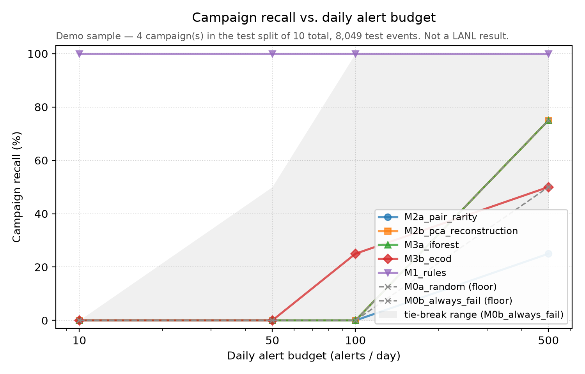

# AuthBench

**How much does deep learning actually buy you in authentication-log anomaly
detection?** A leak-free, alert-budget-constrained benchmark on the LANL
Comprehensive Multi-Source Cyber-Security Events dataset.

[](https://github.com/SaniAdamou14/AuthBench/actions/workflows/ci.yml)

> A SOC cannot triage more than a few dozen alerts per day per analyst. Most
> published anomaly-detection results are reported at operating points no
> analyst could ever use. AuthBench does not propose a new model — it
> measures, under a strictly temporal, leak-free protocol and a realistic
> daily alert budget, how much of the published deep-learning advantage over
> well-built heuristics actually survives.

**No LANL results yet.** The pipeline runs end to end, but only on the demo
sample so far. Every number below is a *demo* number and is not a finding about
any model. See [State of the project](#state-of-the-project).

## What the benchmark measures, on the reference run



Committed output of `make demo`, regenerated byte for byte by CI on every push
— full provenance in [`reports/demo/RUN.md`](reports/demo/RUN.md). 37,844
synthetic events, 10 red-team campaigns, 4 of them in the test split.

| Model | AUC-PR [95% CI] | ROC-AUC | Campaign recall @10 | @50 | @100 | @500 |
|---|---|---:|---:|---:|---:|---:|
| M0a random *(floor)* | 0.0016 [0.0005, 0.0039] | 0.497 | 0% | 0% | 0% | 50% |
| M0b always-fail *(floor)* | 0.0014 [0.0002, 0.0030] | 0.491 | 0% | 0% | 0% | 0% |
| M2a pair rarity | 0.0025 [0.0003, 0.0107] | 0.477 | 0% | 0% | 0% | 25% |
| M2b PCA reconstruction | 0.0040 [0.0007, 0.0135] | 0.784 | 0% | 0% | 0% | 75% |
| M3a Isolation Forest | 0.0042 [0.0007, 0.0105] | 0.798 | 0% | 0% | 0% | 75% |
| M3b ECOD | 0.0046 [0.0005, 0.0187] | 0.690 | 0% | 0% | 25% | 50% |
| **M1 rules** | **0.3305 [0.0840, 0.6423]** | 0.911 | **100%** | **100%** | **100%** | **100%** |

**Read the Isolation Forest row twice.** ROC-AUC 0.798 — a number that would
pass without comment in a paper — and it catches **nothing** at 10, 50 or 100
alerts a day. The two registers do not merely differ in scale; they rank
differently and they disagree about whether the model works at all. That gap is
what the benchmark exists to measure, and it does not depend on the sample being
realistic: it is a property of the operating point.

8 of the 21 pairwise comparisons are significant after Holm-Bonferroni; the
other 13 are not, and are reported as not. Four campaigns in a test split is a
small sample and the intervals say so.

### M1's 100% is partly circular, and here is the measurement

The rules do not win this sample on merit alone. `scripts/generate_demo_data.py`
emits each campaign as a chain — the user authenticates A→B, then B→C — and M1's
rule R7 tests for exactly that: *previous destination equals current source,
within 30 minutes*. The generator and the rule implement **the same predicate**,
so R7 was handed the answer:

| Rule | mean score, benign | mean score, malicious | ratio |
|---|---:|---:|---:|
| **R7 lateral chain** | 0.0056 | 0.6364 | **113×** |
| R6 new auth type | 0.1539 | 0.5455 | 3.5× |
| R1 new pair | 0.3950 | 1.0000 | 2.5× |
| R4 off-hours | 0.7237 | 0.6406 | 0.9× *(no discrimination)* |
| R2 / R3 / R5 | — | 0.0000 | never fire |

That table is generated output, not prose: `reports/demo/tables/rule_discrimination.csv`,
rewritten by every `make demo` and covered by the reproducibility check, so
the caveat cannot quietly stop matching the run it describes.

M1's validation-fitted weights then put **0.521 on R7** — more than half its
score. So "well-built heuristics beat every ML model at every budget" is, on
this sample, largely one tautological rule doing the work. R1 contributes
genuinely (real lateral movement does create new user→host pairs); R4 turns out
not to discriminate at all once the night window is calibrated from data rather
than assumed.

This is a property of a **synthetic sample written by the same author as the
rules**, not a finding about heuristics, and no amount of statistical care fixes
it — the campaign-stratified bootstrap will faithfully report a circular result
with correct confidence intervals. It is the reason the LANL run
([`docs/scaling.md`](docs/scaling.md)) is the project's next milestone rather
than a nice-to-have: on LANL the attacks were carried out by a red team that had
never heard of R7.

## Try it in under a minute

No 6 GB download and no 161 GB of disk required. `data/demo/` ships a small
synthetic sample
(versioned in git) shaped like LANL — same 9-column schema, same `?` null
sentinel, machine accounts, per-user home machines — and carrying ten complete
red-team lateral-movement campaigns.

```bash
make install     # uv venv + uv pip install -e ".[classical,dev]"
make demo        # ~40 s
```

Or without `make`:

```bash
uv venv --python 3.11 .venv
uv pip install -e ".[classical,dev]" --python .venv
.venv/bin/authbench demo          # .venv\Scripts\authbench demo on Windows
```

This runs ingest → clean → label → temporal split → features F1–F4 →
M0/M1/M2/M3 → evaluation, and writes to `reports/demo/`:

| Artifact | What it is |
|---|---|
| `reports/demo/tables/demo_results.json` | every metric, per model |
| `reports/demo/tables/pairwise_comparisons.json` | pairwise AUC-PR tests, Holm-Bonferroni corrected |
| `reports/demo/tables/campaign_summary.csv` | one row per red-team campaign |
| `reports/demo/tables/rule_discrimination.csv` | per-rule separation and calibrated weight, before aggregation (US-118) |
| `reports/demo/figures/campaign_recall_vs_budget.png` | the headline figure |
| `reports/demo/data_quality.json` | null rates, cardinalities, counted drops |

`reports/demo/` is the one directory of pipeline output that *is* committed,
so the results can be read without running anything and CI can assert they
regenerate byte for byte. Everything under `reports/tables/` and
`reports/figures/` — the real-dataset outputs — stays gitignored.

### What the demo sample is

| | |
|---|---|
| Auth events | 37,844 |
| Period | 14 days |
| Red-team events | 27, in 10 campaigns |
| Campaigns per partition | train 3 · val 3 · **test 4** |
| Positive rate | 7.1 × 10⁻⁴ (≈1,000× LANL's — a smoke test, not a scale model) |
| Split | train days 0–7, val 8–10, test 11–13 |

Every partition carries campaigns, and the counts are load-bearing rather than
decorative. A validation window with no positives silently reduces M1's weight
calibration to a single arbitrary random draw. A *test* window with only one
campaign is worse: campaigns are the independent unit of the bootstrap, so one
campaign is a sample size of one, and the comparison table comes back 21 pairs
out of 21 "significant" off a single attack — which is what this sample used to
do. `tests/unit/test_demo_sample_integrity.py` guards both, and
`authbench data generate-demo` regenerates the sample.

## The real dataset

```bash
make install-lanl                             # adds dvc + mlflow; `make install` has neither
authbench preflight                           # disk + RAM budget, before downloading anything
export AUTHBENCH_LANL_EMAIL=you@example.org   # required, see below
authbench data download --dataset lanl
authbench data to-parquet data/raw/auth.txt.gz --out-dir data/interim/auth
dvc repro
```

**Run `authbench preflight` first, and read what it says.** The download is
about 6 GB; converting it and building features is about **161 GB of disk**,
and `train_eval` as written needs far more RAM than a workstation has. On a
laptop this run does not fit, and `preflight` exits non-zero with the event
count that would. [`docs/scaling.md`](docs/scaling.md) has the measured
per-stage budget and the three ways forward.

The expected row count comes from `conf/dataset/lanl.yaml`, not from the
command line — it is a published figure (1,051,430,459) and repeating it in
`dvc.yaml`, in this README and in a shell history is how it eventually
disagrees with itself.

LANL serves `cyber1` from behind a click-through data-use form rather than a
static URL, so `authbench data download` submits an email plus a usage
statement to obtain a token (`ingest.download.fetch_lanl_fence_token`) and
builds the file URLs from it. The address is read from `--email` or
`AUTHBENCH_LANL_EMAIL` and is never written into `conf/`.

LANL publishes no per-file checksums. The first successful download prints
the SHA-256 it computed; record it under `sha256:` in
`conf/dataset/lanl.yaml` and every later run verifies against it and aborts
on mismatch.

| | |
|---|---|
| Source | LANL Comprehensive, Multi-Source Cyber-Security Events (Kent, 2015) |
| Period | 58 consecutive days |
| Auth events | 1,051,430,459 |
| Red-team events | 749 (737 unique after dedup) |
| Positive rate | ≈ 7.1 × 10⁻⁷ |

## Architecture

```
LANL auth.txt.gz + redteam.txt.gz
  -> ingest   (token + resumable download + SHA-256 verify)
  -> parse    (typed schema, machine accounts, explicit nulls, counted drops)
  -> Parquet, partitioned by day, ZSTD
  -> label    (exact quadruplet join, campaign grouping)
  -> split    (temporal train/val/test, leak-free by construction)
  -> features (F1 event, F2 history, F3 novelty, F4 temporal, F5 graph, F6 sequence)
  -> feature store (Parquet, versioned by config hash)
  -> models   (M0 floors, M1 rules, M2 stats, M3 classical, M4 deep, M5 graph)
  -> evaluate (AUC-PR, recall@budget, campaign recall, TTD, bootstrap CIs)
```

Two things are *fitted*, and both are fitted on the training split alone: the
night window (`features.temporal.calibrate_night_window`) and the F1 category
frequency tables (`features.event.fit_frequency_encoding`). Refitting either
per split is a leak that no downstream check catches — it just makes the
numbers better. `tests/unit/test_frequency_encoding.py` holds that line.

Full design rationale: [`AuthBench_Specification.md`](AuthBench_Specification.md).
Implemented protocol: [`docs/methodology.md`](docs/methodology.md).

## Saying "outperforms" only when it is earned

Confidence intervals and pairwise tests come from **one** campaign-stratified
resampling pass shared by every model, so the intervals and the comparisons
sit on the same sampling distribution and each difference is paired.

Three floors sit under this. Two of them produce results that look exactly
like a genuine "no difference" finding, and one produces the opposite — a
clean sweep of "outperforms" — while having nothing to do with the models:

- **Degenerate resamples.** A ranking metric over zero positives is
  undefined, but scikit-learn returns 0.0 — so on such a resample every model
  ties, and those ties land in both tails of a two-sided test. With one
  campaign in the test split, ~37% of resamples are degenerate and every
  p-value is floored near 0.74. They are discarded and redrawn;
  `n_degenerate_discarded` is reported, because a high count is itself a
  finding about the split.
- **Bootstrap resolution vs. Holm.** A percentile bootstrap cannot report a
  p-value below `2/(R+1)`, and Holm's strictest threshold is `alpha/n_pairs`.
  For the 8-model catalog that needs `R ≥ 1119`; the config's original 1000
  could never have produced a single significant result.
  `stats_tests.minimum_resamples_for_family` computes the bound and warns
  when it is not met.
- **One campaign is not a sample.** The sample size of a campaign-stratified
  bootstrap is the number of *campaigns*, not the number of events. With a
  single campaign in the test split, every resample is a re-weighting of the
  same attack: no pairwise difference can change sign, the tail count is zero,
  and every p-value lands on the resolution floor `2/(R+1)` — which is *below*
  Holm's threshold, so all 21 demo comparisons came back "outperforms" off one
  campaign. That is the bootstrap's resolution being reported as evidence
  about the models. `stats_tests.MIN_CAMPAIGNS_FOR_SIGNIFICANCE` withholds the
  verdict below two campaigns; the point estimates and intervals still stand,
  and `authbench demo` now prints 0/21 with the reason.

## State of the project

Being explicit about this is part of the point of the benchmark.

**Runs end to end today**

- Ingest, parse, label, temporal split with a mechanical leakage guard.
- Features F1 (event), F2 (history), F3 (novelty), F4 (temporal).
- Models M0a random, M0b always-fail, M1 rules (7 rules, weights calibrated
  on validation), M2a pair-rarity, M2b PCA reconstruction, M3a Isolation
  Forest, M3b ECOD/HBOS.
- Evaluation, in two registers the report keeps separate:
  - *operational* — event and campaign recall at daily alert budgets,
    time-to-detection per campaign, AUC-PR with campaign-stratified CIs;
  - *literature-comparable* — ROC-AUC, global precision@k, recall at a fixed
    FPR, each reported for placement against published numbers, not ranking.
- Pairwise AUC-PR comparisons across the whole model family, Holm-Bonferroni
  corrected. The report generator can only emit the word "outperforms" on the
  significant branch (`render_comparison_sentence`).

**Implemented and unit-tested, but not yet wired into the reported tables**

- SHAP alert cards (`explain/`) — needs the `explain` extra.
- F5 graph / F6 sequence features and the M4 deep / M5a graph models — these
  need the `deep` / `graph` extras and are not part of the default DVC stage.

**Not implemented**

- An out-of-core `train_eval`. It loads each split whole and the estimators
  copy the design matrix, so at LANL scale it asks for hundreds of GB of RAM.
  Fitting on a bounded sample and scoring in day-partitioned chunks is the
  fix; [`docs/scaling.md`](docs/scaling.md) sets out the four steps. Until
  that lands, the full dataset is not runnable on ordinary hardware, and
  `authbench preflight` says so before anything is downloaded.
- The R1 (unsupervised) / R2 (semi-supervised) training regimes. The key
  exists in `conf/split/*.yaml`; nothing reads it yet.
- M5b GNN link prediction — raises `NotImplementedError` on purpose rather
  than shipping a decorative implementation.
- `reports/paper/`. There is deliberately no `report` stage in `dvc.yaml`: a
  stage depending on a `main.tex` that does not exist breaks `dvc repro` at
  the last step for everyone.

## Development

```bash
make lint        # ruff check + ruff format --check, on src tests scripts
make typecheck   # mypy --strict on src
make test        # pytest with coverage
make demo        # the full pipeline on the demo sample
make preflight   # disk/RAM budget for a full LANL run on this machine
```

CI runs all four on every push and PR, plus a coverage gate of 85% on
`evaluate/` and `features/`, and uploads `reports/` as an artifact.

Requires Python ≥3.11, <3.13. Optional extras: `classical` (PyOD), `deep`
(torch), `graph` (networkx/node2vec), `explain` (shap), `dashboard`
(streamlit), `tracking` (mlflow/dvc), `dev`, `all`.

## Limits

- A single real dataset (LANL, 2015, one enterprise network) — transferability
  to modern cloud/MFA environments is not established.
- Red-team labels are a partial ground truth: an unflagged event may still be
  a true compromise never caught at the time.
- Campaign grouping has no canonical definition; the gap threshold is a
  published, sensitivity-tested parameter rather than a hidden constant.
- No adaptive adversary: LANL's red team was not evading these specific models.

Full discussion: [`docs/limitations.md`](docs/limitations.md).
Scope of use: [`docs/ethics.md`](docs/ethics.md).

## Citing the dataset

> Kent, A. D. (2015). *Comprehensive, Multi-Source Cyber-Security Events*.
> Los Alamos National Laboratory. https://doi.org/10.17021/1179829

## License

Code: Apache 2.0 (see `LICENSE`). LANL and CERT data are not redistributed —
only the download scripts are, under the terms of each dataset's own license
(see [`docs/ethics.md`](docs/ethics.md)).
